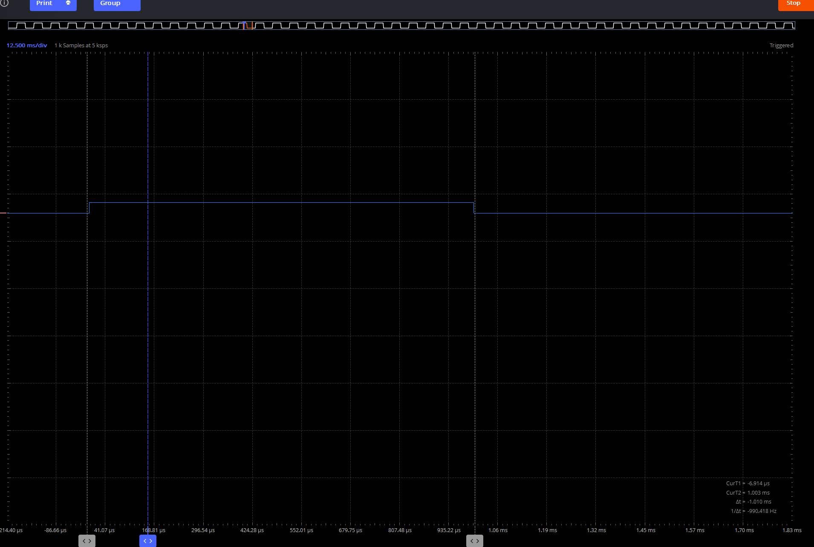
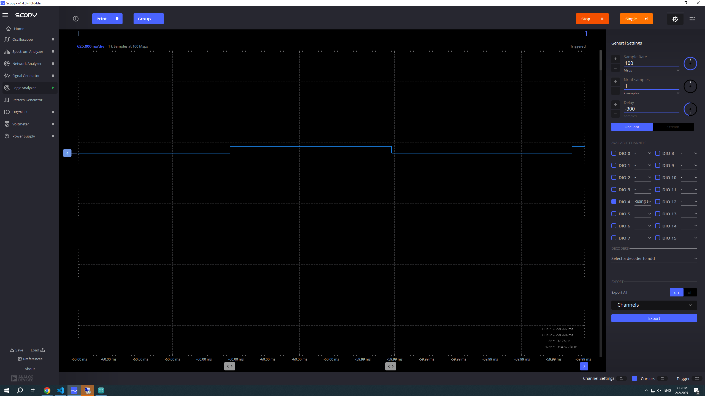

# Project 3: Measuring minimum delay in Arduino using the ADALM2000 logic analyzer

1. Understand the use of variables in code
2. Learn how to use a logic analyzer
3. Understand the concept of overhead and measure it

## resources
[Arduino Functions Reference](https://www.arduino.cc/reference/en/)

## Change Blink.ino code
 - Save Blink example as BlinkWithVariableDelay.ino in this folder
 - Use a variable to change built in led (13) to grove led (4)
 - Use a variable to change delay to 1 ms 
 - upload to arduino
 - can you see the led blink? Why?
```
The LED is blinking on and off every 1 millisecond (ms), which means it's completing one full blink cycle (on + off) every 2 ms.
The human eye cannot perceive such rapid changes. Anything faster than about 30-60 Hz (frames per second) appears as a continuous light instead of blinking.

At this speed, the LED will appear to be dimly lit or as if it's constantly on, because your eyes can't detect the rapid on/off switching.
```

## Use logic analyzer to see and measure the blink
 - connect ADALM2000 to grove kit: 
    - gnd in ADALM to GND in arduino (black color is used as a standard for GND)
    - digital pin 0 (solid pink) to pin13 in arduino (why?)  
   ```
   Becuse the scopy app need the 0 value (ground) 
   ``` 
 - open scopy program 
 - connect to ADALM2000
 - open scopy logic analyzer
 - activate DIO0 and rising edge and run (why?)
 - play with the scopy parameters until you can see the separate blinks. Which parameter(s) do you need to change? 
 ```
 in scopy app i needed to change the sample rate in order to see the freq of the hz.
 ```
 - use cursors and sample rate to measure the pulse width
 - take screenshots and add them to the README below.
 

## Measure overhead
 - Remove the delay statements and upload the code
 - Measure pulse width. ? this is the overhead.
 ```
 the over head in 3 um
 ```
 - Take screenshots and add them to the README below.
 
 
## even shorter blink
- delay() is limited to 1 ms. Find a function that delays 1 microsecond. 
 - Try different delays and measure the overhead.
 - Take screenshots and add them to the README below.
 

## Git
 - Commit the new README with your screenshots
 - push to your repo.

## Exercise
Paste screenshots below.

